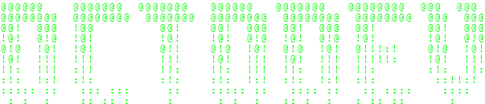

# 👋 Welcome to my GitHub Profile — OctoDev Studios

Hi! I'm **OctoDev**, a developer passionate about coding and creating cool, innovative projects. I work on personal projects and experiments.

 

## 👨‍💻 About Me
- 🎓 Self-taught, I learn by exploring and building
- 💻 I specialize in **HTML, CSS**, and some other programming languages

## ⚙️ Technologies I Use
- **Languages**: HTML, CSS, JavaScript, PHP, Python, C#
- **Tools**: Git, GitHub, VS Code

## 💬 Let’s Chat!
Feel free to reach out if you’d like to talk about web development, beginner tips, or just share insights on programming.

Discord: @octodevv5
Discord Server: (in construction) (FRENCH 🇫🇷)
Telegram: @octodevv1

---

Thanks for visiting my profile, and see you in the repos! 👾
